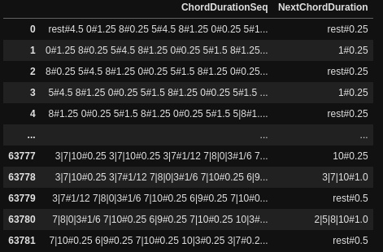

# Classical Music Generator

## Dependencies

1. Python 3.6.
2. Cuda 10.1.
3. CuDNN 7.
4. [Python modules](./research/requirements.txt).

## Generated Samples

Generated samples can be found in the [ `./samples` folder](./samples).

## Data

### Data Sources

Data for the discriminator model is from:

1. [Classical Music MIDI](https://www.kaggle.com/soumikrakshit/classical-music-midi).
2. [Music Midi Collection](https://www.kaggle.com/programgeek01/anime-music-midi).

Data for the generator model is from [Piano Midi website](http://www.piano-midi.de/beeth.htm).

All of it can be downloaded from [Google Drive](https://drive.google.com/file/d/1qCCsXel_YdtJorfCqk3tztVHQ-jxSXKT/view?usp=sharing).

### Data Processing

Every midi file was split into midi file element subsequences of size `101` . Every chord and note was normalized and converted to the string, the duration of each element was converted to the string too, and then stored to the `pandas.DataFrame` :


The generator models were trained with only Beethoven compositions from: `./research/data/classic/beethoven/` folder. `DataFrame` with the sequence of chords, durations, and the next chord for this sequence was created:



More information about data processing can be found in the [Data Processing Notebook](./research/data_processing.ipynb).

## Model Training

### Discriminator Model

This model was trained to see can we discriminate between classical music and other genres with its notes as an input.

Its architecture is simple Embedding and 2 consecutive LSTM layers.

With just 2 epochs it achieves `0.9999` accuracy on the validation set:

``` 

Epoch 1/2
1983/1983 [==============================] - 32s 16ms/step - loss: 0.0623 - accuracy: 0.9760 - val_loss: 0.0171 - val_accuracy: 0.9947
Epoch 2/2
1983/1983 [==============================] - 31s 16ms/step - loss: 0.0079 - accuracy: 0.9973 - val_loss: 0.0014 - val_accuracy: 0.9999
```

More information can be found in [Discriminator Notebook](./research/discriminator.ipynb).

### Generator Model

3 models with slightly different architectures were trained:

1. `ChordGeneratorMusicModel`: BiLstm+SelfAttention+Lstm.
2. `EmbChordGeneratorMusicModel`: Embedding+BiLstm+SelfAttention+Lstm+Lstm. The same as previous but with the Embedding layer and additional Lstm layer.
3. `SimpleEmbChordGeneratorMusicModel` Embedding+BiLstm+Lstm+Lstm. The same as previous but without the attention layer.

|                | ChordGeneratorMusicModel | EmbChordGeneratorMusicModel | SimpleEmbChordGeneratorMusicModel |
|----------------|--------------------------|-----------------------------|-----------------------------------|
| Train Loss     |          2.0936          |            1.9999           |                2.5130             |
| Val Loss       |          4.8717          |            4.5071           |                4.5120             |
| Train accuracy |          0.7142          |            0.7140           |                0.6161             |
| Val accuracy   |          0.3754          |            0.4553           |                0.3739             |

More information can be found in [Generator Notebook](./research/generator.ipynb).

## Samples Generation

Samples are generated with `EmbChordGeneratorMusicModel` model.

To generate samples:

1. [Download and untar model](https://drive.google.com/file/d/1VLejqR8YLGdDJCoA_BK62WgejBVdX1uT/view?usp=sharing) to the `./research/modles` folder.
2. [Download seed dataset](https://drive.google.com/file/d/1Twbi_YdlT0CwjsSfjb3lu08esZbV1E2x/view?usp=sharing) and add it to the `./research/data` folder.
3. Run `docker-compose up --build` from the root of the repository. You can change values in `./docker-compose.yml` to configure the generator.
